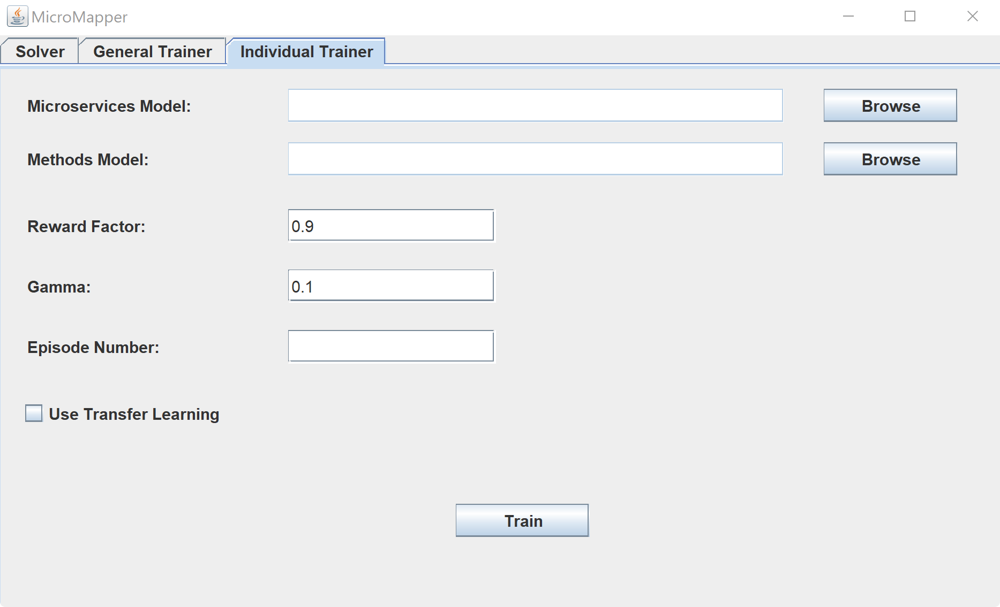

# MS-MDE-RL
This project aims to facilitate migration from monolithic software architectures to Microservices by using Reinforcement Learning and Model Driven Engineering.
## Setup
This project can be cloned as a Maven Java Project. All the dependencies are present in the pom file.
## Sample Models
This project comes with sample Microservices and Methods models of 5 software systems in the models folder.
## Pretrained NNETs (Neural Networks)
This project comes with pretrained NNETs (neural networks) to map methods to microservices for software systems with up to 9 microservice in the trained folder. You can train your own neural networks for larger systems as well. Each of these pretrained NNETs are trained for 10,000 episodes.
## Using Graphical User Interface
For the convenience of the users, a GUI (Graphical User Interface) has been developed. It can be accessed by running the GUI class from the gui package.
The GUI has three tabs.
### Solver Tab

This tab provides the means to map the methods of a software system to the microservices using an already trained NNET. 
The Neural Network can be either a general or an individually trained NNET.

After choosing the NNET, Microservices model and Methods model, by clicking the solve button, the result of the mapping will be printed in the white box at the bottom of the window.
### General Trainer Tab

This tab provides the ability to train a general NNET that can solve problems up to a certain number of microservices. In this tab we can also alter the predefined parameters and create custom general NNETs.
By clicking the train button, the generated NNET will be saved for future use via the Solver Tab.
### Individual Trainer Tab

This tab provides the individual training capability. In this tab, the user chooses the Microservice and Methods models of the software system and then defines the number of training episodes. By clicking the Train button, a NNET will be generated and saved to be used in the Solver tab.

This tab also provides the Transfer Learning functionality so the users can use another NNET to be places as the initial configuration of the NNET and further train that NNET.
## Using The Codes
### General Approach
This project comes with pretrained NNETs (neural networks) to map methods to microservices for software systems with up to 9 microservice. You can train your own neural networks for larger systems as well. Each of these pretrained NNETs are trained for 10,000 episodes.
#### Running Pretrained NNETs
By executing the main method of the GeneralSolver.java, the program will ask for the services model in JSON format and then the methods model also in JSON format. Then it will find the pretrained NNET with appropriate number of microservices and generates the mapping of methods to microservices. The output will be shown in the console.
#### Training new NNETs
By executing the main method of the GeneralTrainer.java, a new NNET will be trained.
The number of training episodes, reward factor and gamma can be defined here.

`private static QLearningConfiguration qLearningConfiguration = QLearningConfiguration.builder()`

`.maxEpochStep(Integer.MAX_VALUE)`

`.maxStep(10 * 1000)`

`.rewardFactor(0.9)`

`.gamma(0.1)`

`.build();`

The number of microservices should be defined in the GeneralMDP.java file as the MAX_MICROSERVICE attribute.

`public static final int MAX_MICROSERVICE = 9;`

After the training, the NNET can be used as other pretrained NNETs.

### Individual Approach
In the individual approach, for each software system, we train and then use a new NNET.
#### Training from scratch
The IndividualApproach.java class works like the GeneralTrainer.java and GeneralSolver.java classes put together, so can change the training configuration as you wish like the GeneralTrainer, and you will be prompted for the microservices and the methods model like the GeneralSolver.
#### Transfer Learning from General Approach
By using the IndividualApproachWithTransfer.java it is possible to load a General NNET as the starting point of training for the Individual Approach, given that there exist a pretrained General NNET with the same number of microservices.